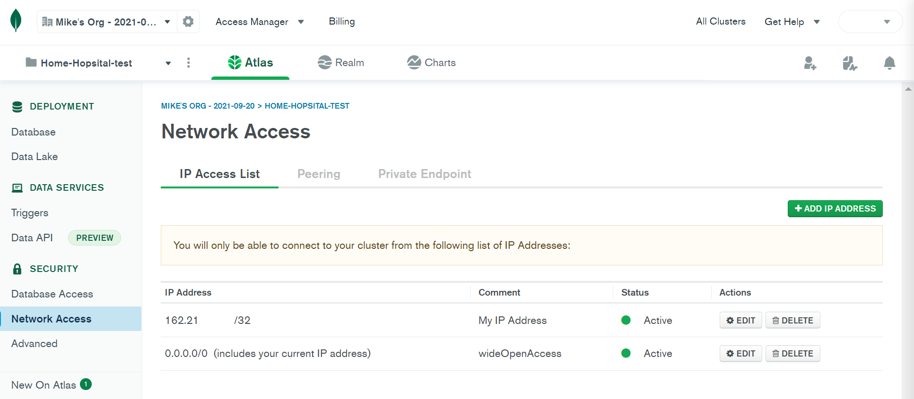
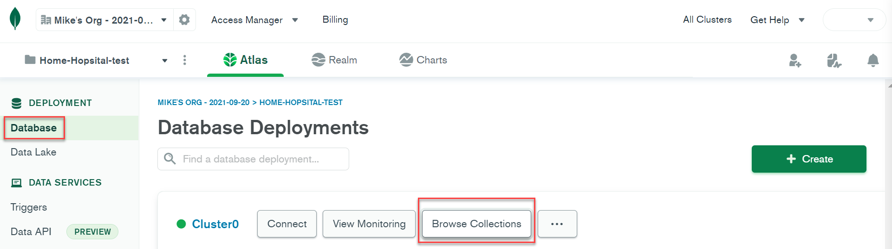
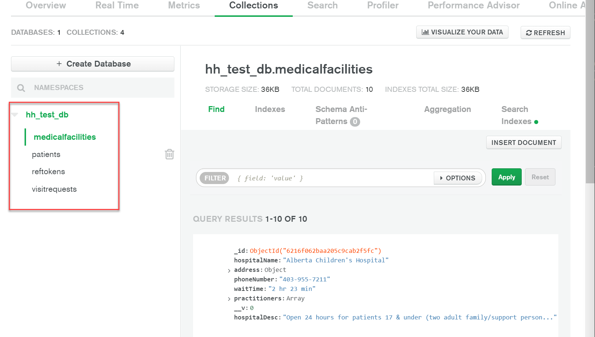

<h1 style='color: purple'> Home Hospital FrontEnd</h1>
Here is all of the source code for the frontend application used to power the HomeHospital application using React.

#### Table of Contents

- [Running Frontend App](#frontend)
- [Merge GitHub Branches](#merge)
- [Access MongoDB](#mongo)
- [PostMan](#postman)

<h3 style='color: purple' id="frontend"> Instructions running the frontend application</h3>
Make sure to have node and npm installed on your system.

1. Pull in the branch that you are trying to work on through GitHub.

```
git checkout <branch-name>
```

2. Run the following commands to install and run the node dependencies

```
npm install
```

3. To run the React application go to the main directory where the source files are located.

```
<directory-where-you-cloned-branch>/HomeHospital/HomeHospital-Frontend\hh-front>
```

eg. D:\React Apps\HomeHospital\HomeHospital-Frontend\hh-front>

4. Run React Application

```
npm start
```

<h3 style='color: purple' id="merge"> Instructions to merge front to backend or vice versa</h3>

1. Go to the branch that you want to merge.

```
git checkout <branch-name>
```

2. Do a git pull to get the latest updates to that branch

```
git pull
```

3. Go back to the branch that you want to merge to. eg. I want to merge the frontend to the backend. Then I would go to the frontend branch and then do a git merge

```
git checkout <branch-name>
```

eg. git checkout frontend-branch

```
git merge <branch-name>
```

eg. git merge backend-branch

<h5>Your branch is now up to date with the branch you wanted to merge with.</h5>

<h3 style='color: purple' id="mongo">Accessing MongoDB from the Web</h3>

1. Go to MongoDB website and sign in.
   [MongoDB Website](https://www.mongodb.com/)
   <br />
2. Go to network access on the left side menu and make sure that your ip address is added to the network.
   
   <br />
3. Go to Database on the left side menu and then click on browse collection to see all collections of database for this project.
   
   <br />
4. Select the database that you want to view and all the collections will show up for that database.
   
   <br />

<h3 style='color: purple' id="postman">Using Postman for HTTP Requests</h3>

1. Download Postman from [Postman](https://www.postman.com/downloads/)

2.
